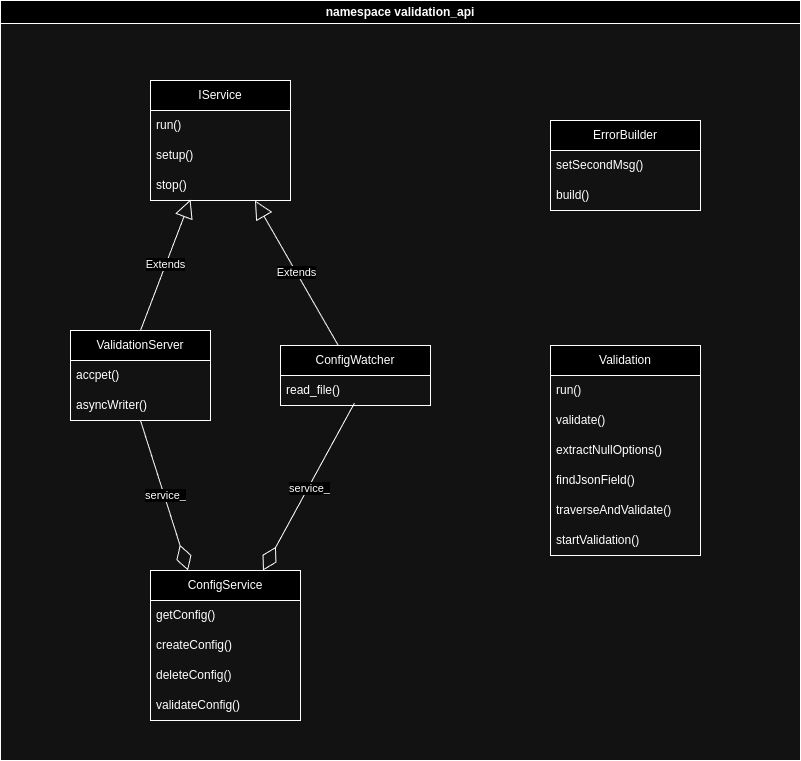

# Validation-api

[Docs](https://ezpcy.github.io/validation-api/)

**Version**: 0.5

**Creation date**: August 29, 2023 2:33 PM

## Code Structure

- [`src`] contains:
  - [`lib`] module which contains some helper functions
    - [`Helpers`] collection of helper functions
    - [`ErrorBuilder`] for building error messages
  - [`main`]
  - [`ConfigService`] for handling the configurations
  - [`ConfigWatcher`] for watching the configuration files
  - [`Logger`] for logging
  - [`ValidationServer`] for handling the incoming requests
- [`include`] header files



## Description

At runtime configurable API to validate data from incoming network requests. The API will validate the incoming data based on the rules defined in XML files.

## Pre-requisites

- CMake
- Conan (for installing dependencies)
- Linux
- Clang/gcc

## Installation

Clone the repository and run `./build.sh r` inside the root folder.

- This will read the configurations and run the API on `127.0.0.1:8080`.
- If you want to create a configuration folder run:

```bash
./validation-api example
```

## XML Configuration

The XML configuration files should be stored inside the folder called `configs` next to the executable. The files can be modified at runtime and the changes will be reflected in the API.

### XML Configuration Structure

Example of a field:

```xml
 <Telephone type="string" notNull="true" eq="10"/>
```

- `type`: The type of the field
- `notNull`: If the field can be null or not
- `eq`: The length of the field it must be equal to

**Types**:

- `string`: Example: "Hello"
- `number`: Example: 123
- `float`: Example: 123.45
- `date`: Example: "2023-08-29"
- `uuid`: Example: "550e8400-e29b-41d4-a716-446655440000"
- `email` Example: "test@gmail.com"
- `boolean`: Example: true
- `ahv`: Example: "756.1234.5678.12" (you can generate a random AHV number here [uhutools.ch](https://www.uhutools.ch/ahv-nummer/de))
- `iban`: Example: "CH9300762011623852957"

**Options**:

- `uuid`: uuid value inside null option
- `notNull`: If the field can be null or not

For `string`, `number` and `float`:

- `eq`: Length (for strings) or value (for numbers)
- `min`: The minimum value of the field (for numbers) or the minimum length of the field (for strings)
- `max`: The maximum value of the field (for numbers) or the maximum length of the field (for strings)


## Nesting

You can nest fields in the XML configuration file.

Example:

```xml
  <InsuranceProductConfig notNull="true">
      <TarifNumber type="number" notNull="true" eq="7" />
      <BillingCategory type="String" notNull="true" />
      <Price type="float" notNull="true" />
      <Units type="number" notNull="true" />
  </InsuranceProductConfig>
```

Note that capitalization of the tag names is important. For options like `notNull`, `eq`, `min` and `max` the capitalization is not important.

### Null Nesting

With Null Nesting you can specify that a field can be null if other fields satisfy a given a `UUID`:

```xml
<Institution type="uuid">
    <Null>
        <TypeOfProvision uuid="123e4567-e89b-12d3-a456-526614174000"/>
        <Profession uuid="123e4567-e89b-12d3-a456-226614174000"/>
    </Null>
</Institution>
```

- `Instution` can be null if `TypeOfProvision` and `Profession` are not null and have the given `UUID`.

## Example

```xml
<Test>
  <Provision notNull="true">
    <ProvisionNumber type="Number" notNull="true" eq="14" />
    <CostApproval type="Boolean" notNull="true" />
  </Provision>
  <TypeOfProvision type="Uuid" notNull="false" />
  <Profession type="Uuid" notNull="true" />
  <SalaryType type="Uuid" notNull="false" />
  <DateFrom type="Date" notNull="true" />
  <DateTo type="Date" notNull="true" />
  <InsuranceProductConfig notNull="true">
    <TarifNumber type="Number" notNull="true" eq="7" />
    <BillingCategory type="String" notNull="true" />
    <Price type="Float" notNull="true" />
    <Units type="Number" notNull="true" />
  </InsuranceProductConfig>
  <Institution type="Uuid">
    <Null>
      <TypeOfProvision uuid="123e4567-e89b-12d3-a456-526614174000" />
      <Profession uuid="123e4567-e89b-12d3-a456-226614174000" />
    </Null>
  </Institution>
  <School type="String" notNull="false" />
  <ApprenticeshipType type="Uuid" notNull="false" />
  <Location type="Uuid" notNull="false" />
</Test>
```

This configuration file will validate the incoming data. The data must be in `JSON` format. A valid request would look like this:

```json
{
  "Test": {
    "Provision": { "ProvisionNumber": 12345678901234, "CostApproval": true },
    "TypeOfProvision": "123e4567-e89b-12d3-a456-526614174000",
    "Profession": "123e4567-e89b-12d3-a456-226614174000",
    "SalaryType": "123e4567-e89b-12d3-a456-426614174000",
    "DateFrom": "2020-01-01",
    "DateTo": "2020-12-31",
    "InsuranceProductConfig": {
      "TarifNumber": 1234567,
      "BillingCategory": "Test",
      "Price": 123.45,
      "Units": 3
    },
    "Institution": "",
    "School": "Test",
    "ApprenticeshipType ": "123e4567-e89b-12d3-a456-426614174000",
    "Location": ""
  }
}
```

Connect to the API (can be done with Netcat or Telnet): 

```bash
telnet 127.0.0.1 8080
```

## Logs

Information and error logs can be found within the `logs` folder (created at runtime).
